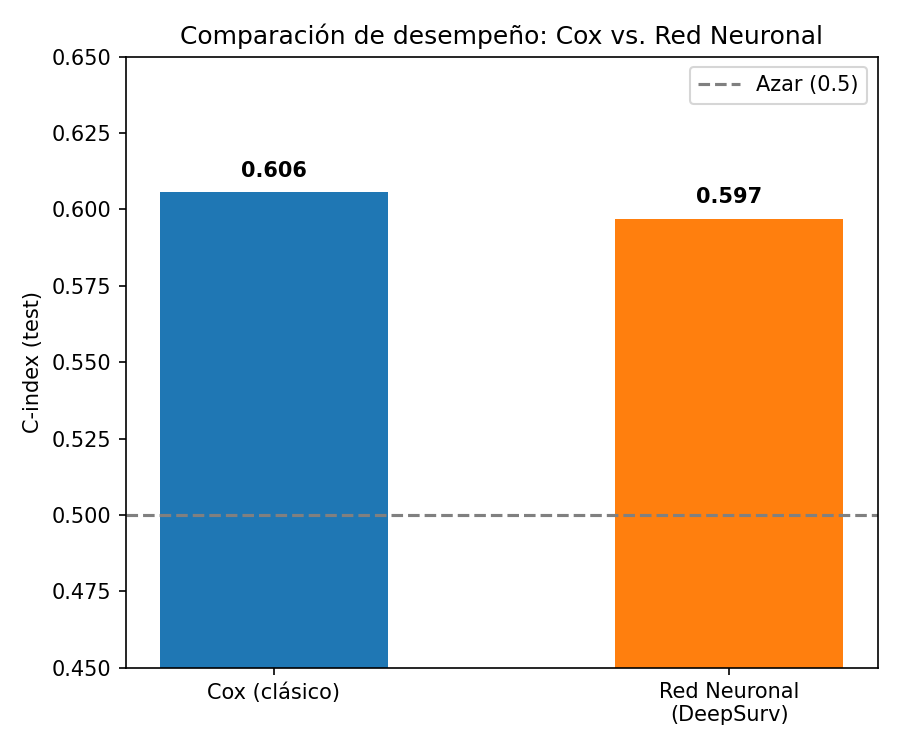
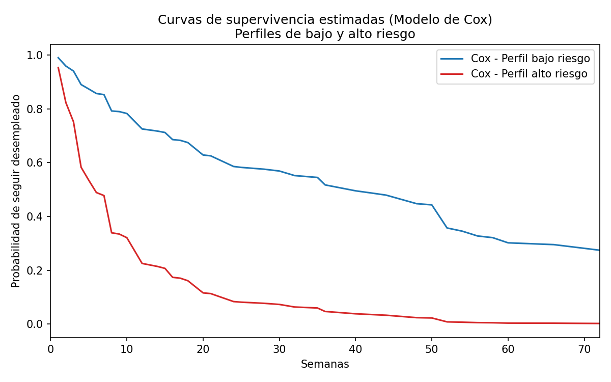

# Unemployment Duration Model: Cox vs. Deep Learning (DeepSurv)

Survival analysis applied to job-search duration in Colombia's rural population, comparing a classical statistical model (Cox Proportional Hazards) against a neural network (DeepSurv) trained with the same loss function.

*[Versión en español](README.md)*

## The problem

How long does it take someone to find a job, and which sociodemographic factors speed up or slow down that process? Instead of treating this as a binary classification problem (employed/unemployed), it is modeled as a **survival analysis** problem: time until an event occurs (finding a job), capturing both whether the event happened and how long it took.

## The data

Microdata from Colombia's **Gran Encuesta Integrada de Hogares (GEIH)**, published by DANE (Colombia's national statistics department), filtered to the rural population (`clase == 2`). Public data source: [microdatos.dane.gov.co](https://microdatos.dane.gov.co/index.php/catalog/central/search?q=GEIH)

After cleaning (filtering to the employed population, removing "don't know/no answer" responses, and dropping missing values), the final sample consisted of **356 observations**, split into 284 for training and 72 for testing.

**Variables used:** sex, age (grouped), education level, household head status, marital status, socioeconomic stratum (grouped), job-search channel, non-labor income, and search time in weeks.

**Important limitation, stated honestly:** the final data subset contains no censored observations — everyone in the final sample eventually found a job. This means the analysis compares the *speed* of finding employment across different profiles, not the probability of never finding one. With a sample size of 356, results should be interpreted with caution, especially for categories with few cases (for example, "Postgraduate" was merged with "University" in the education variable due to low representation).

## Methodology

### 1. Cox Model (classical baseline)

Cox Proportional Hazards model, regularized (`penalizer=0.1`) for numerical stability given the reduced sample size. Implemented with [`lifelines`](https://lifelines.readthedocs.io/).

### 2. DeepSurv (neural network)

A simple neural network (one hidden layer of 8 neurons, 0.3 dropout) trained with the **same loss function** as the classical Cox model: the negative partial log-likelihood (Breslow approximation). This allows for a mathematically fair comparison between both approaches. Implemented in pure PyTorch, with L2 regularization (`weight_decay`) to mitigate overfitting given the sample size.

The architecture was deliberately kept simple: with only 284 training observations, a deeper network would carry a high risk of overfitting with no real upside.

## Results

| Model | C-index (test) |
|---|---|
| Cox (classical) | **0.6056** |
| Neural Network (DeepSurv) | 0.5970 |



The classical Cox model slightly outperformed the neural network. The difference is small but consistent with what would be expected given the sample size and the nature of the variables (sociodemographic, with mostly linear or low-order relationships with risk).

### Significant variables (Cox, p < 0.05)

- **Non-labor income** (p < 0.005): having a non-labor income source slows down the speed of finding employment — consistent with lower immediate urgency to seek work.
- **Age 41-60** (p < 0.005): this age group takes significantly longer to find employment than those under 28.
- **Marital status (widowed)** (p = 0.03): find employment faster than the reference group, though with a wide confidence interval given the low number of cases in this category.

### Estimated survival curves



Comparison between a low-risk and a high-risk profile according to the Cox model, showing the probability of remaining unemployed over time.

## Conclusion: when to use each approach

This project does not aim to argue that deep learning "doesn't work" for survival analysis in general — the finding is more specific and more useful: **with a small dataset (a few hundred observations) and predominantly linear relationships between sociodemographic variables and risk, a regularized Cox model matches or outperforms a neural network**, with the added benefit of interpretable coefficients and direct statistical significance.

A neural network would be expected to add real value in scenarios with:
- Substantially larger datasets (thousands or tens of thousands of observations).
- Strong non-linear relationships or complex interactions between variables that a linear model doesn't capture without manual specification.
- High-dimensional inputs (text, images, dense time series) where representation learning is a structural advantage, not just an option.

## Repository structure

```
├── data_processing.py    # Data cleaning and preparation (Python, migrated from R)
├── cox_model.py          # Cox Proportional Hazards model
├── deepsurv_model.py     # Neural network (DeepSurv) in PyTorch
├── comparacion_c_index.png
├── curvas_supervivencia_cox.png
└── README.md
```

## Tech stack

Python · pandas · lifelines · PyTorch · scikit-learn · matplotlib

## Background

This analysis originated from a model built in R (`survival`, `coxph`) during a statistical consulting engagement, later migrated and extended to Python with the addition of the deep learning component for this comparison.